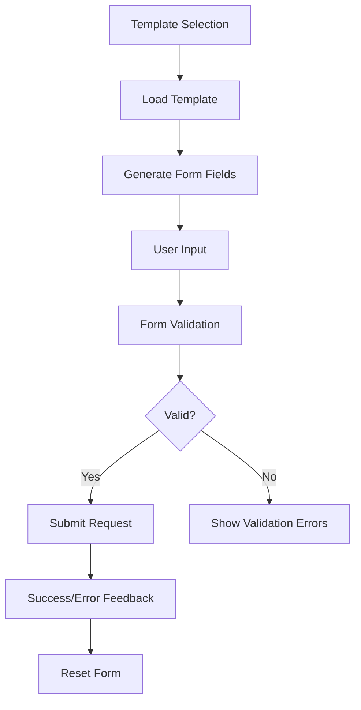

# Workfront Request Form - Dynamic Form Generator

## 📋 Overview

The Workfront Request Form is a dynamic form generation capability that allows users to create and submit Workfront requests based on configurable JSON templates. This component supports multiple field types, validation, and demo mode for testing.

## 🎯 Features

### ✅ **Dynamic Form Generation**
- Renders forms based on JSON template configuration
- Supports multiple field types: text, number, textarea, select, boolean, date
- Automatic form validation based on required fields
- Real-time form state management

### ✅ **Template Management**
- Pre-configured templates for common Workfront request types
- Template selection interface with descriptions
- Support for custom templates via JSON configuration

### ✅ **Demo Mode Support**
- Mock data for testing without backend services
- Simulated form submission with loading states
- Success/error feedback for user experience testing

### ✅ **Form Field Types**
- **Text**: Single-line text input
- **Number**: Numeric input with validation
- **Textarea**: Multi-line text input
- **Select**: Dropdown with predefined options
- **Boolean**: Switch/toggle for yes/no values
- **Date**: Date picker input

## 🏗️ Architecture

### **Component Structure**
```
WorkfrontRequestForm
├── Template Selection View
│   ├── Template List
│   ├── Template Details
│   └── Template Selection
└── Dynamic Form View
    ├── Form Fields (Dynamic)
    ├── Validation
    ├── Submission
    └── Status Feedback
```

### **Data Flow**


## 📊 Data Models

### **WorkfrontRequest Interface**
```typescript
interface WorkfrontRequest {
    name: string;                    // Request name
    projectID: string;              // Workfront project ID
    queueDefID: string;             // Queue definition ID
    parameterValues: Record<string, any>; // Form field values
}
```

### **WorkfrontField Interface**
```typescript
interface WorkfrontField {
    id: string;                     // Field identifier
    name: string;                   // Display name
    type: 'text' | 'number' | 'textarea' | 'select' | 'boolean' | 'date';
    required: boolean;              // Required field flag
    options?: string[];             // Options for select fields
    placeholder?: string;           // Placeholder text
    description?: string;           // Field description
}
```

### **WorkfrontFormTemplate Interface**
```typescript
interface WorkfrontFormTemplate {
    id: string;                     // Template identifier
    name: string;                   // Template name
    description: string;            // Template description
    projectID: string;              // Default project ID
    queueDefID: string;             // Default queue ID
    fields: WorkfrontField[];       // Form fields
}
```

## 🎨 User Interface

### **Template Selection View**
- **Template Cards**: Each template displayed as a card with:
  - Template name and description
  - Project ID and Queue ID
  - Field count indicator
  - "Use This Template" button
- **Status Indicators**: Color-coded status lights for:
  - Project ID (info)
  - Queue ID (notice)
  - Field count (positive)

### **Dynamic Form View**
- **Form Header**: Template name with back navigation
- **Dynamic Fields**: Rendered based on template configuration
- **Validation**: Real-time validation with visual feedback
- **Action Buttons**: Submit, Reset, and Back navigation
- **Status Feedback**: Success/error messages with status lights

## 🔧 Configuration

### **Template Configuration Example**
```json
{
    "id": "rebate-request",
    "name": "Rebate Request Submission",
    "description": "Submit rebate requests for customer purchases",
    "projectID": "PROJ-12345",
    "queueDefID": "QUEUE-REBATE-001",
    "fields": [
        {
            "id": "DE:Customer Name",
            "name": "Customer Name",
            "type": "text",
            "required": true,
            "placeholder": "Enter customer name",
            "description": "Full name of the customer requesting rebate"
        },
        {
            "id": "DE:Amount",
            "name": "Rebate Amount",
            "type": "number",
            "required": true,
            "placeholder": "0.00",
            "description": "Amount of rebate requested in USD"
        },
        {
            "id": "DE:Product Category",
            "name": "Product Category",
            "type": "select",
            "required": true,
            "options": ["Electronics", "Software", "Services", "Hardware", "Consulting"],
            "description": "Category of product/service for rebate"
        }
    ]
}
```

## 🚀 Usage

### **Accessing the Component**
1. Navigate to `/workfront_requests` in the application
2. Select a template from the available options
3. Fill out the dynamic form fields
4. Submit the request

### **Demo Mode**
- Enable demo mode with `AIO_ENABLE_DEMO_MODE=true`
- Access mock templates and simulated submission
- Test form validation and user experience

### **Form Submission**
- Validates all required fields before submission
- Shows loading state during submission
- Provides success/error feedback
- Automatically resets form after successful submission

## 📝 Mock Templates

### **1. Rebate Request Submission**
- **Purpose**: Submit rebate requests for customer purchases
- **Fields**: Customer Name, Amount, Product Category, Reason, Urgent Flag
- **Use Case**: Customer service rebate processing

### **2. Approval Request**
- **Purpose**: Request approval for various business processes
- **Fields**: Request Type, Amount, Business Justification, Deadline
- **Use Case**: Budget and resource approval workflows

### **3. Support Ticket**
- **Purpose**: Create support tickets for technical issues
- **Fields**: Issue Type, Priority, Description, Steps to Reproduce
- **Use Case**: Technical support and bug reporting

## 🔍 Form Field Types

### **Text Field**
```typescript
{
    "type": "text",
    "placeholder": "Enter text here",
    "description": "Single-line text input"
}
```

### **Number Field**
```typescript
{
    "type": "number",
    "placeholder": "0.00",
    "description": "Numeric input with validation"
}
```

### **Textarea Field**
```typescript
{
    "type": "textarea",
    "placeholder": "Enter detailed description...",
    "description": "Multi-line text input",
    "rows": 4
}
```

### **Select Field**
```typescript
{
    "type": "select",
    "options": ["Option 1", "Option 2", "Option 3"],
    "description": "Dropdown selection"
}
```

### **Boolean Field**
```typescript
{
    "type": "boolean",
    "description": "Yes/No toggle switch"
}
```

### **Date Field**
```typescript
{
    "type": "date",
    "placeholder": "YYYY-MM-DD",
    "description": "Date picker input"
}
```

## ✅ Validation

### **Required Field Validation**
- Checks all required fields are filled
- Shows validation errors in real-time
- Prevents submission until all required fields are complete

### **Form State Management**
- Tracks form data changes
- Maintains form state during navigation
- Provides form reset functionality

### **Submission Validation**
- Validates form before submission
- Shows loading state during submission
- Provides clear success/error feedback

## 🎯 Benefits

### **✅ Flexibility**
- Dynamic form generation from JSON configuration
- Support for multiple field types
- Easy template customization

### **✅ User Experience**
- Intuitive template selection
- Real-time validation feedback
- Clear navigation and status indicators

### **✅ Developer Experience**
- TypeScript interfaces for type safety
- Modular component architecture
- Comprehensive demo mode for testing

### **✅ Maintainability**
- Centralized template configuration
- Reusable form field components
- Clear separation of concerns

## 🔮 Future Enhancements

### **Planned Features**
- **Custom Templates**: User-defined template creation
- **Template Import/Export**: JSON template file management
- **Field Dependencies**: Conditional field display
- **File Upload**: Support for file attachment fields
- **Multi-step Forms**: Wizard-style form progression

### **Integration Opportunities**
- **Workfront API**: Direct integration with Workfront APIs
- **Template Management**: Backend template storage and retrieval
- **User Permissions**: Role-based template access
- **Audit Trail**: Request submission history and tracking

## 🧪 Testing

### **Demo Mode Testing**
1. Enable demo mode in environment variables
2. Navigate to Workfront Requests page
3. Test template selection and form generation
4. Validate form submission and feedback
5. Test form reset and navigation

### **Form Validation Testing**
- Test required field validation
- Test different field types
- Test form submission with valid/invalid data
- Test form reset functionality

### **User Experience Testing**
- Test template selection flow
- Test form navigation and back button
- Test loading states and feedback
- Test responsive design on different screen sizes

## 📚 Related Documentation

- [Demo Mode Implementation Guide](DEMO_MODE_INSTRUCTIONS.md)
- [React Spectrum Component Usage](https://react-spectrum.adobe.com/react-spectrum/index.html)
- [Adobe App Builder Documentation](https://developer.adobe.com/app-builder/)
- [Workfront API Documentation](https://developer.workfront.com/)

---

**Last Updated**: December 2024  
**Version**: 1.0.0  
**Component**: WorkfrontRequestForm  
**Demo Mode**: ✅ Supported

