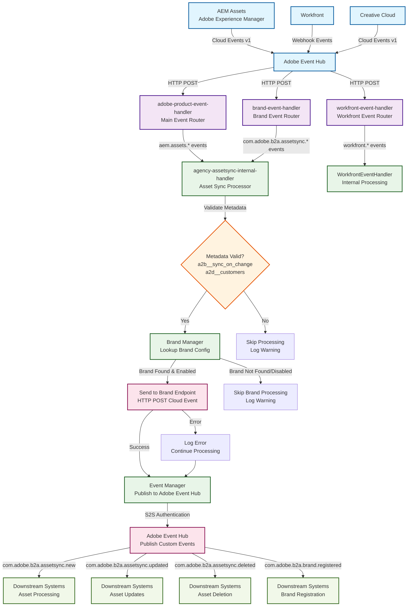

# AEM Event Flow Architecture Chart

This document provides a comprehensive overview of how AEM events flow through the a2b-agency system, from initial reception to final processing and downstream event publishing.

## Event Flow Overview

## Detailed Event Processing Flow

### 1. Event Reception
- **AEM Assets** generates Cloud Events v1 format events for asset operations
- **Adobe Event Hub** receives and routes events to configured webhook endpoints
- Events include metadata like `a2b__sync_on_change` and `a2d__customers` for processing control

### 2. Event Routing
- **adobe-product-event-handler**: Routes AEM asset events (`aem.assets.asset.*`)
- **brand-event-handler**: Routes brand-specific events (`com.adobe.b2a.assetsync.*`)
- **workfront-event-handler**: Routes Workfront events

### 3. Asset Sync Processing
- **agency-assetsync-internal-handler** processes asset events
- Validates required metadata fields
- Looks up brand configuration using Brand Manager
- Sends events to brand-specific endpoints if configured

### 4. Event Publishing
- **Event Manager** handles S2S authentication with Adobe Event Hub
- Publishes custom events in Cloud Events v1 format
- Includes runtime isolation information for multi-tenant support

## Supported Event Types

### AEM Asset Events (Input)
| Event Type | Description | Handler |
|------------|-------------|---------|
| `aem.assets.asset.created` | New asset created in AEM | agency-assetsync-internal-handler |
| `aem.assets.asset.updated` | Asset updated in AEM | agency-assetsync-internal-handler |
| `aem.assets.asset.deleted` | Asset deleted from AEM | agency-assetsync-internal-handler |
| `aem.assets.asset.metadata_updated` | Asset metadata changed | agency-assetsync-internal-handler |

### Brand Asset Sync Events (Internal)
| Event Type | Description | Published To |
|------------|-------------|--------------|
| `com.adobe.b2a.assetsync.new` | New asset sync event | Adobe Event Hub |
| `com.adobe.b2a.assetsync.updated` | Asset sync update event | Adobe Event Hub |
| `com.adobe.b2a.assetsync.deleted` | Asset sync deletion event | Adobe Event Hub |

### Brand Registration Events
| Event Type | Description | Published To |
|------------|-------------|--------------|
| `com.adobe.b2a.brand.registered` | New brand registration | Adobe Event Hub |

### Workfront Events
| Event Type | Description | Handler |
|------------|-------------|---------|
| `workfront.task.created` | New Workfront task | WorkfrontEventHandler |
| `workfront.task.updated` | Workfront task updated | WorkfrontEventHandler |
| `workfront.task.completed` | Workfront task completed | WorkfrontEventHandler |

## Technical Implementation Details

### Authentication Flow
1. **S2S Authentication**: Uses Adobe I/O Service-to-Service credentials
2. **Runtime Isolation**: Each event includes `app_runtime_info` for multi-tenant support
3. **Token Management**: Automatic token refresh for Adobe Event Hub publishing

### Event Validation
- **Metadata Validation**: Checks for required fields like `a2b__sync_on_change`
- **Brand Validation**: Ensures brand exists and is enabled before processing
- **Event Structure**: Validates Cloud Events v1 format compliance

### Error Handling
- **Graceful Degradation**: Continues processing even if brand endpoint fails
- **Comprehensive Logging**: Detailed error logging with context
- **Retry Logic**: Built-in retry mechanisms for transient failures

### Performance Considerations
- **Lazy Loading**: Runtime configuration loaded on-demand
- **Async Processing**: Non-blocking event processing
- **Resource Optimization**: Efficient memory usage for large asset operations

## Configuration Requirements

### Required Environment Variables
- `AIO_runtime_apihost`: Adobe I/O Runtime API host
- `AIO_runtime_auth`: Runtime authentication key
- `AIO_runtime_namespace`: Runtime namespace
- `LOG_LEVEL`: Logging level (debug, info, warn, error)

### Brand Configuration
- **Endpoint URL**: Brand-specific webhook endpoint
- **Authentication**: Brand-specific authentication credentials
- **Enabled Status**: Boolean flag to enable/disable processing

### Adobe Event Hub Configuration
- **Provider ID**: Unique identifier for event provider
- **Event Schema**: Cloud Events v1 format compliance
- **S2S Credentials**: Service-to-service authentication setup

## Monitoring and Observability

### Logging
- **Structured Logging**: JSON-formatted logs with correlation IDs
- **Event Tracing**: End-to-end event flow tracking
- **Performance Metrics**: Processing time and success rates

### Error Tracking
- **Error Classification**: Categorized error types for monitoring
- **Alerting**: Configurable alerts for critical failures
- **Recovery**: Automatic retry and manual intervention capabilities

This architecture provides a robust, scalable, and maintainable event processing system that can handle high-volume AEM asset operations while maintaining data integrity and providing comprehensive observability.

